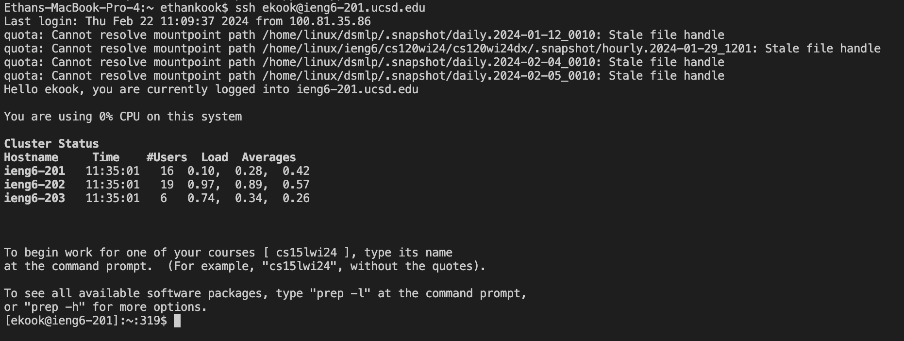
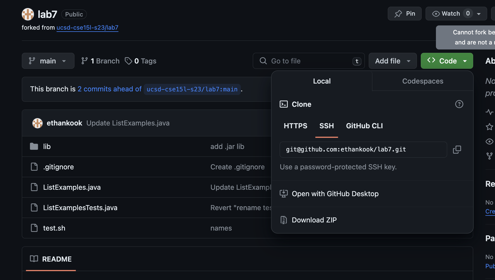
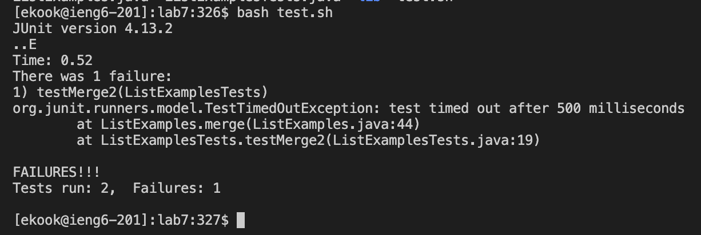
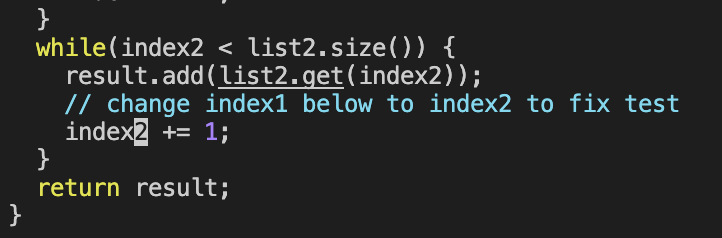
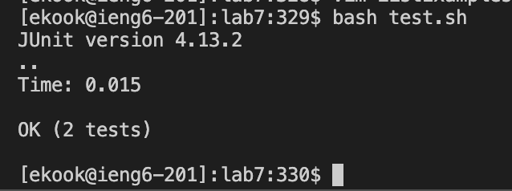
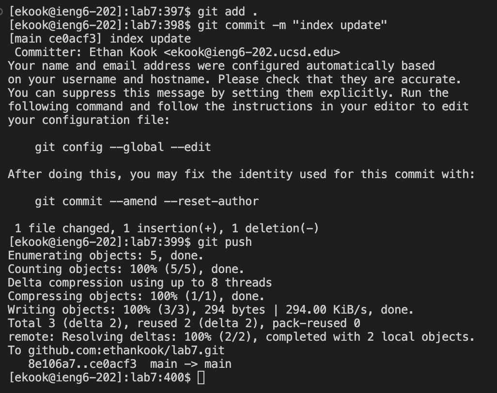

## Lab Report 4 -- Vim (Week 7)

# Steps 4-9 :
4. Log into ieng6
   
   `ssh ekook@ieng6-201.ucsd.edu` in terminal to log into ieng6 account. (Logged into machine 201 because 203 tends to have problems).
   
   
5. Clone your fork of the repository from your Github account (using the SSH URL)
   
   Copied the link, as shown below and typed `git clone git@github.com:ethankook/lab7.git` into the terminal to clone the forked repository.
   ```Keystrokes : <g><i><t><space><c><l><o><n><e><space><command, v> (pasted url).```
   
   
7. Run the tests, demonstrating that they fail
   
   `bash test.sh` in terminal to run tests for `ListExamples.java`.
   
   
8. Edit the code file to fix the failing test
   
   `cd lab7` and `vim ListExamples.java` in the terminal to move into the cloned repository and open `ListExamples.java` in vim.
   ```
   keys presssed:
   <4><3><j> --> moves down 43 lines to the line with the error.
   <e> --> moves to end of the first word.
   <x> --> deletes current character (in this case, removes the 1).
   <i> --> enters insert mode.
   <2> --> types in a 2, where the 1 used to be.
   <esc> --> enters normal mode.
   <:><w><q><enter> --> saves and exits vim.
   ```
   
   
9. Run the tests, demonstrating that they now succeed
   
   `bash test.sh` in terminal to run tests again. Results shown below.
   

10. Commit and push the resulting change to your Github account (you can pick any commit message!)

    `git add .` in terminal to add all changes to commit.
   `git commit -m "message"` to commit the changes with a commit message.
   `git push` to push the changes to forked github repository.
   
   
   
   
